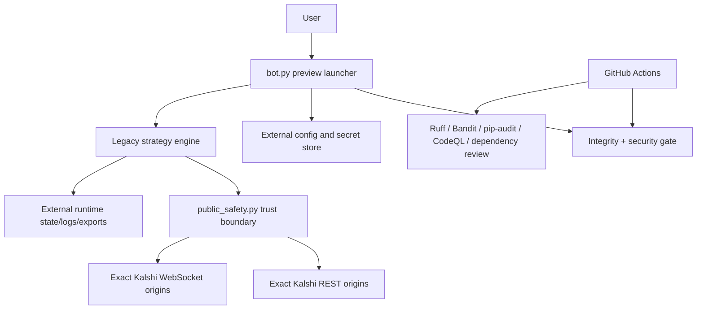

# Architecture

## Preview launcher

`bot.py` owns user intent. It strips security-critical inherited environment variables, selects demo or production read access from external config, creates external data/export paths, requires preview-only dry run, and starts the retained engine as a child process. Legacy live command names stop before configuration or subprocess launch and point to the separately reviewed 10x1c flagship.

## Independent trust boundary

`public_safety.py` is intentionally small. It owns the literal `PUBLIC_PREVIEW_ONLY=True` sentinel, rejects every mutating method, validates API origins and paths, prevents repository-local secret/runtime storage, validates private-key file shape, applies owner-only Unix permissions, masks identifiers, and redacts common Kalshi credential headers.

## Strategy engine

`kalshi_15m_sell_bot.py` is the retained large engine. It handles authenticated REST, WebSockets, rate limiting, exchange status, market discovery, position/order/fill reconciliation, fee guards, sell coverage, persistence, reports, and recovery logic. Public safety checks are enforced at central request, storage, key-loading, archive, WebSocket, and startup boundaries.

## Data flow

1. The launcher reads external configuration.
2. It creates a sanitized child environment and external storage directories.
3. The engine validates credentials and the selected official endpoint.
4. Read requests may retrieve market/account data.
5. Engine startup verifies the immutable preview sentinel and dry-run mode.
6. The final request boundary rejects every non-GET method before signing or transmission, independent of runtime flags.
7. State and logs remain outside the repository.

## Why the engine was not fully rewritten

A full rewrite would be easier to read but would discard a large amount of behavior and create a different, lightly tested system. This preview instead makes the active trust boundary small and reviewable while documenting the retained engine as residual risk. Future work should decompose the engine behind typed interfaces and smaller modules.
